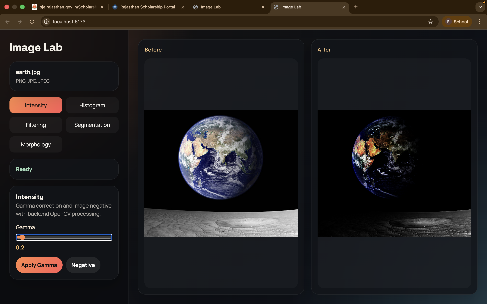

# Image Lab 🖼️
**Hybrid Image Processing Platform**



**Image Lab** is a highly interactive, hybrid image processing application that brings the power of computer vision directly to the browser.
Developed as a group project, it utilizes a modular architecture to seamlessly bridge a responsive frontend with high-performance OpenCV backend operations.

### 👥 Project Team (Group Six)
* **Ravi Kumawat** (Roll No. 202351121)
* **Sangramjeet Kumar** (Roll No. 202352329) 
* **Supervised by:** Prof. Jignesh Patel, *Indian Institute of Information Technology Vadodara (IIITV)*

---

## 🌊 Application Flow

The core architecture is strictly separated into a client control plane and a processing server to ensure maximum scale and separation of concerns.

1. **Upload & Control:** The user uploads an image via the **React + Vite Frontend**. They select a module and tweak variables (e.g. Gamma sliders, Thresholds) getting instantaneous UI feedback.
2. **Transmission:** Upon interacting with a processing trigger, the frontend debounces the inputs and fires an async POST request containing the image file and configuration parameters.
3. **Execution:** The **FastAPI Backend** receives the request and routes it to specific services. **OpenCV (`cv2`)** executes extreme low-level array manipulations on the image matrix.
4. **Delivery:** The backend encodes the transformed image matrix back into a buffer and returns it to the client.
5. **Comparison:** The React frontend updates its global state and renders the new image into a dedicated Before/After comparison slider, allowing the user to precisely track the impact of their operation.

---

## 🛠️ Implemented Modules

Our codebase supports 5 foundational computer vision categories:

* **Intensity Operations:** Gamma correction, Negative inversions.
* **Histogram Processing:** Global equalization, Contrast Limited Adaptive Histogram Equalization (CLAHE).
* **Spatial Filtering:** Gaussian Blur, Edge Sharpening, Canny Edge Detection.
* **Segmentation:** Manual Binary Thresholding, Otsu's Statistical Thresholding. 
* **Morphological Operations:** Erode, Dilate, Open (Noise Removal), Close (Gap Filling).

---

## 🚀 How to Run Locally

If you are cloning this repository, you will need to run the Backend API and the Frontend Server concurrently.

### 1. Start the FastAPI Backend
The backend utilizes Python and OpenCV. Open a terminal and run the following:

```bash
# Navigate to the backend directory
cd backend

# Create and activate a virtual environment
python3 -m venv .venv
source .venv/bin/activate  # On Windows use: .venv\Scripts\activate

# Install all required Python dependencies
pip install -r requirements.txt

# Start the local ASGI server
uvicorn app.main:app --reload
```
*The backend will now be actively listening on `http://localhost:8000`.*

### 2. Start the React Frontend
Open a **new, separate terminal window** and run the following:

```bash
# Navigate to the frontend directory
cd frontend

# Install all required Node.js dependencies
npm install

# Start the Vite development server
npm run dev
```

*Your terminal will output a `http://localhost:5173` (or similar) link. Click it to open Image Lab in your browser!*
